# RGR - Raster Graphics Redactor

## Постановка задачі

Розробити програму для обробки растрових зображень в ООП стилі 
Windows desctop application 
Language - C++

## Функціональні вимоги

- Зображення завантажується з файлу формату BMP 24 бит на піксел: після вибору меню "Файл – Відкрити..." спочатку з’являється стандартне діалогове вікно (GetOpenFileName), у якому показується список папок та файлів. У цьому вікні вибирається потрібний файл зображення. Дані з файлу завантажуються у пам’ять і потім показуються у головному вікні.
- Програма повинна  змінювати світлоту, контраст та корекцію компонент R, G, B
- Режим роботи вибирається після натискування відповідної кнопки на Toolbar.Стрічка Toolbar розташовується у головному вікні під меню. Потрібно передбачити підказки (Tooltips) для кожної кнопки.
- Потрібно передбачити скролінг по горизонталі та вертикалі, щоб забезпечити показ  зображень, розмірами більше головного вікна. Передбачити коректне реагування на можливу зміну розмірів головного вікна.
- Програма повинна вміти записувати результат обробки – зображення у файли формату BMP 24 бит на піксел. Для цього передбачити пункти меню "Файл–Записати", та "Файл–Записати як. . .". У останньому випадку вибір нового імені файлу через стандартне вікно (GetSaveFileName).

## Основні модулі

-	модуль Viewer відображення у головному вікні;
-	модуль Toolbar підтримки Toolbar;
-	модуль Files підтримки запису-читання файлів зображень.
- модуль Scrollbar для скорлінгу робочого поля у головному вікні;
- функції приближення / віддаленя зображення(zoom/unzoom)

## Тест програми

> ### Меню

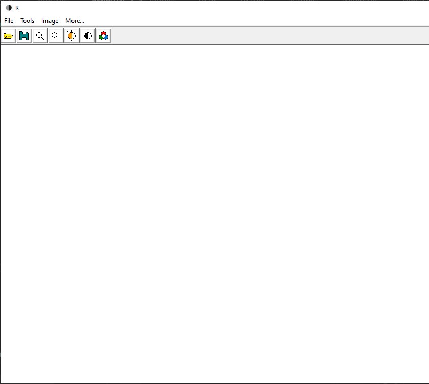

### Відкриття файлу

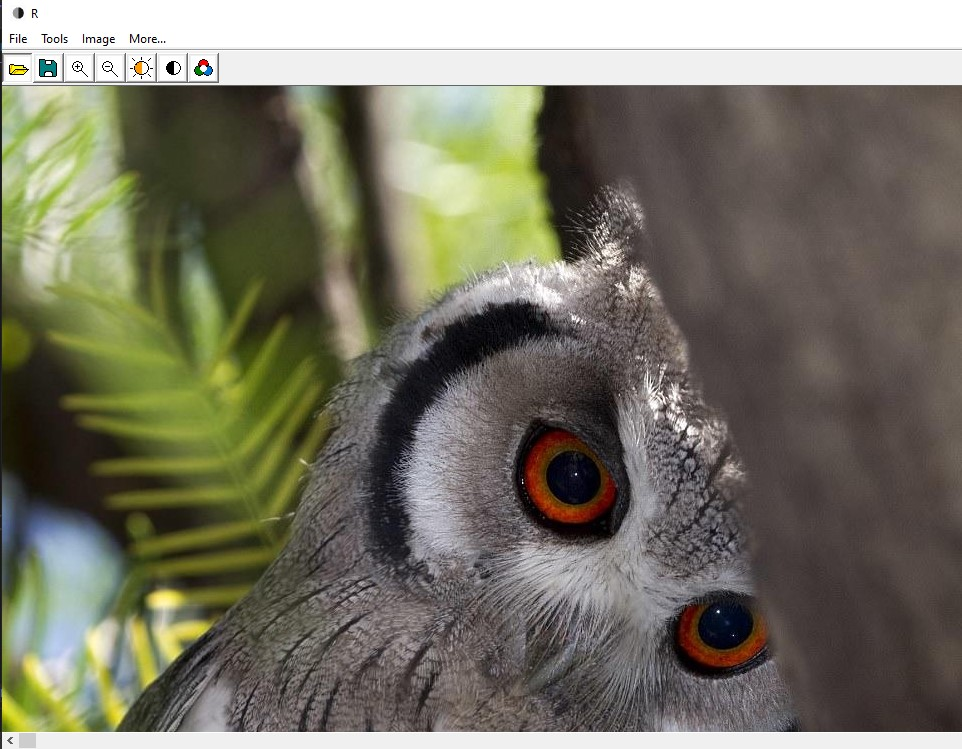

> ### Інструмент приближення

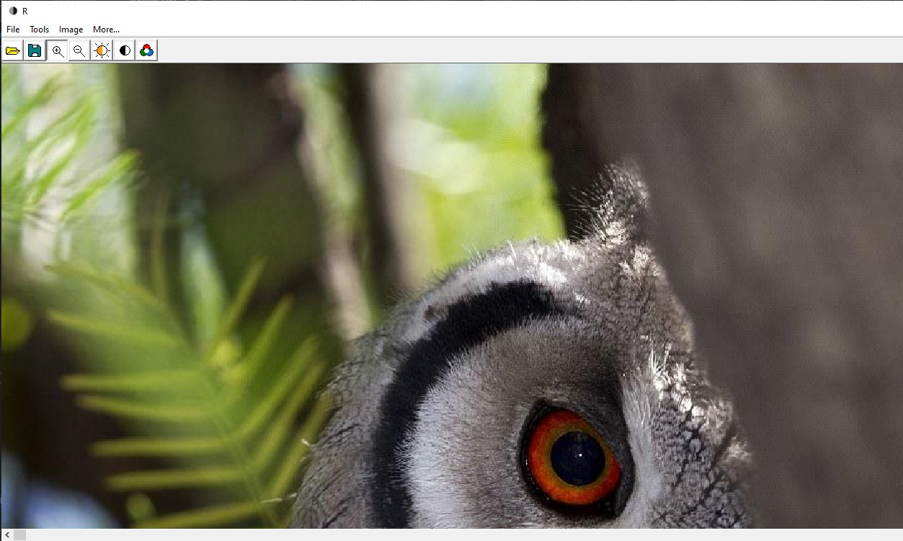

> ### Налаштування яскравості

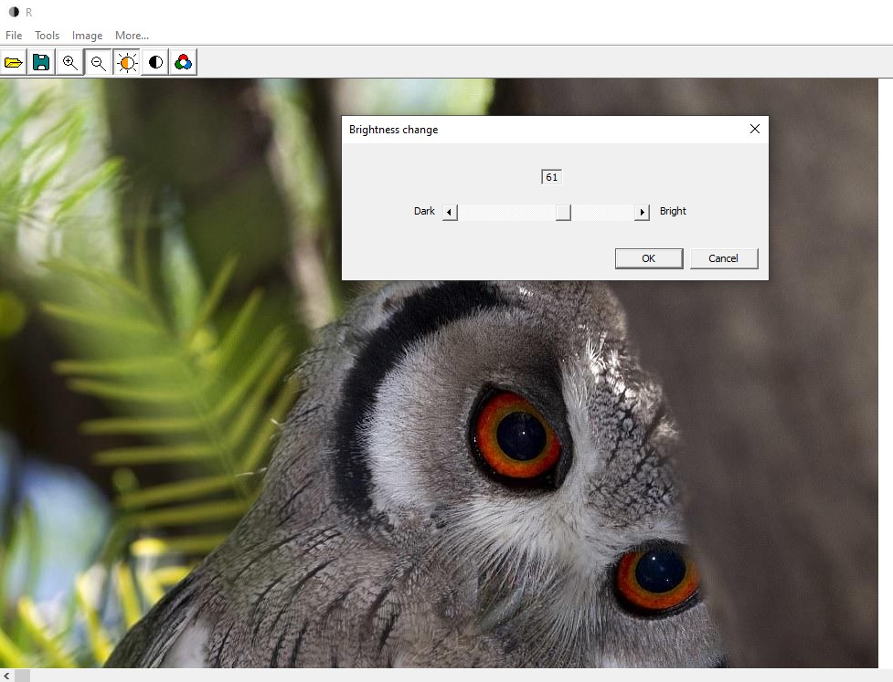

> ### Результат

> ### Налаштування контрастності

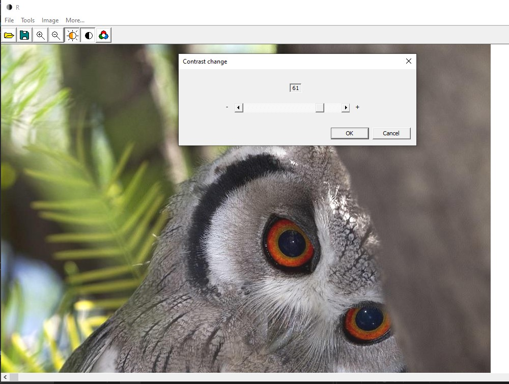

> ### Результат

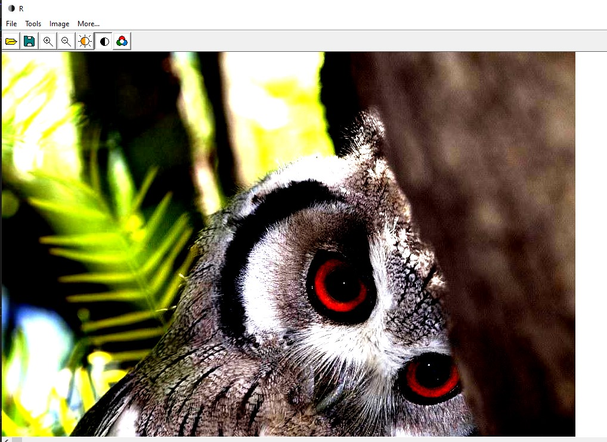

> ### Налаштування RGB каналів

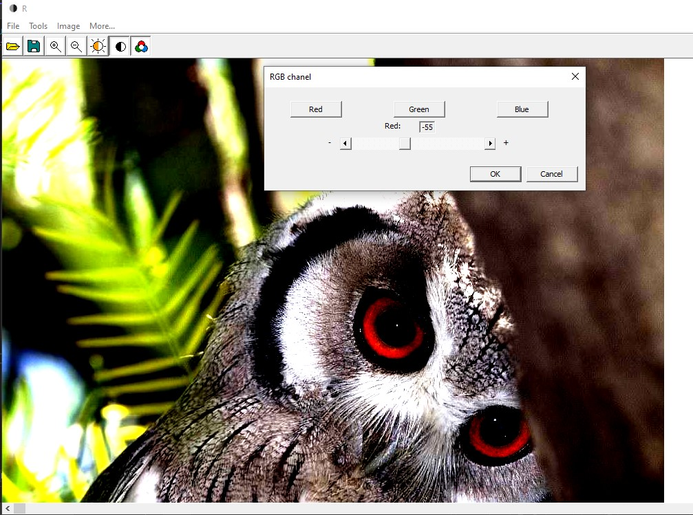

> ### Результат

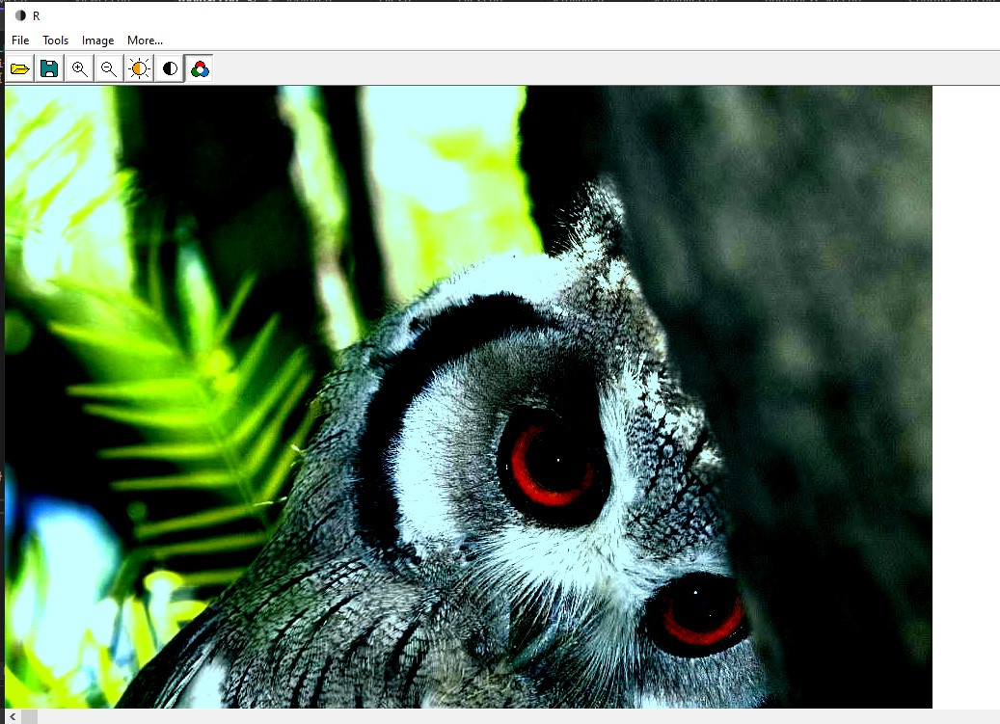

> ### Збереження файлу

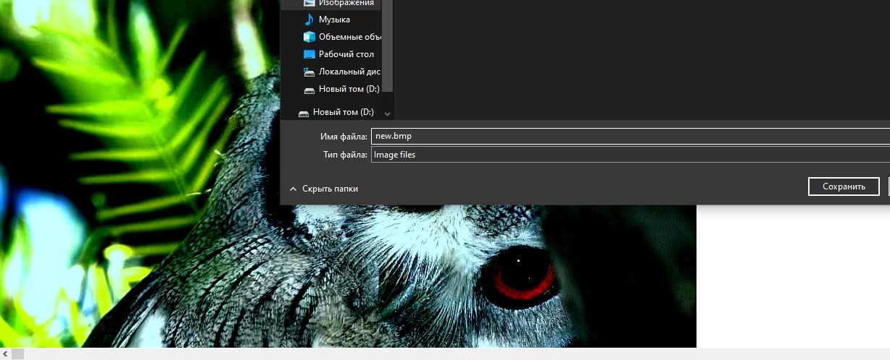

> ### Результат

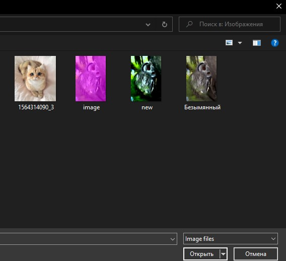

> ### Відкриття файлу більшого за 24 біти

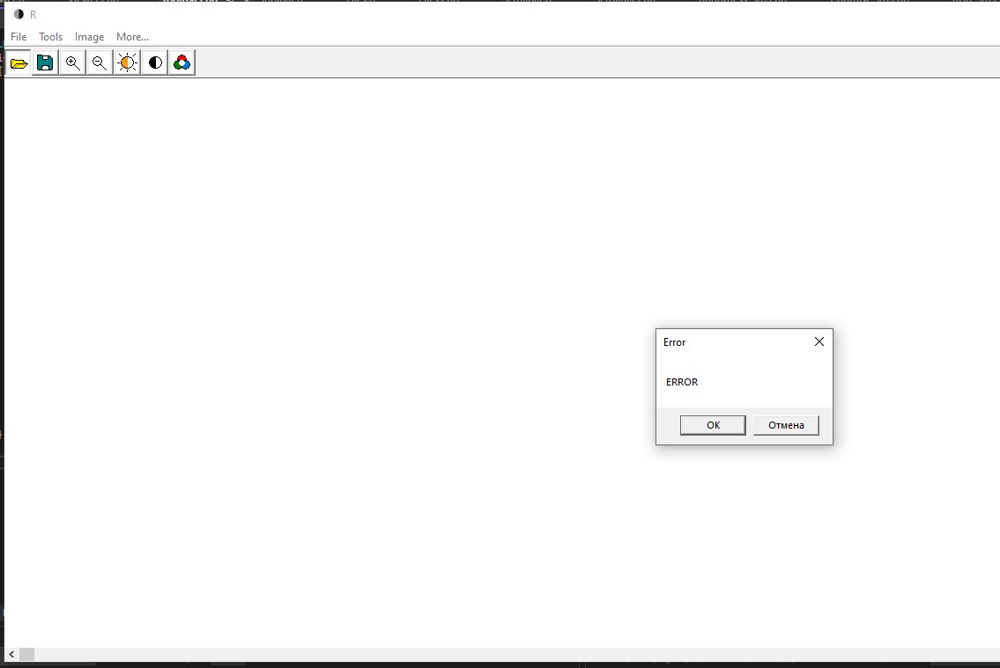
